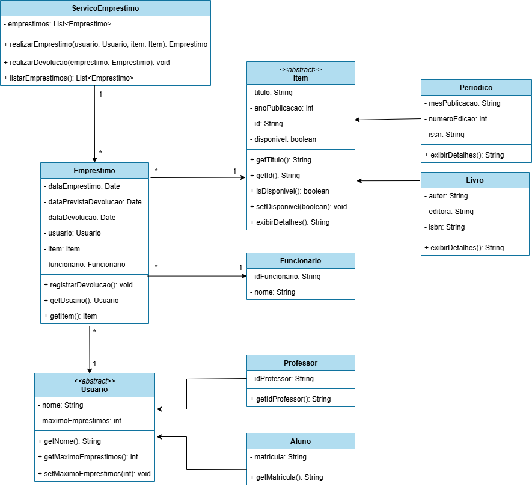

# 📚 Sistema de Gerenciamento de Biblioteca

**Um sistema orientado a objetos para gerenciar empréstimos, devoluções e o acervo de uma biblioteca.**

---

# 📋 Sobre o Projeto

Este projeto apresenta a **modelagem de um sistema de gerenciamento de biblioteca**, desenvolvida com base nos princípios da **Programação Orientada a Objetos (POO)** e nas boas práticas de design orientado a objetos, incluindo os princípios **SOLID**.

O diagrama de classes demonstra uma estrutura com **separação clara de responsabilidades entre as classes**, promovendo:

- **baixo acoplamento**
- **alta coesão**
- **facilidade de manutenção e extensão**

O sistema permite controlar o **empréstimo e a devolução de itens do acervo** (como livros e periódicos) realizados por diferentes tipos de usuários (**alunos e professores**), com o suporte de **funcionários da biblioteca**.

---

# 🗂️ Diagrama de Classes

  

---

# 💡 Conceitos de POO Aplicados

O projeto utiliza diversos conceitos fundamentais de **Programação Orientada a Objetos**:

- **Herança**  
  `Livro` e `Periodico` estendem `Item`, enquanto `Aluno` e `Professor` estendem `Usuario`.

- **Polimorfismo**  
  O método `exibirDetalhes()` é sobrescrito nas subclasses de `Item`, permitindo comportamentos diferentes para cada tipo de item.

- **Encapsulamento**  
  Os atributos das classes são privados e acessados por meio de **getters e setters**, garantindo controle sobre o acesso aos dados.

- **Abstração**  
  As classes `Item` e `Usuario` são definidas como **abstratas**, servindo como base para especializações do sistema.

- **Associação**  
  As classes se relacionam através de associações, como entre `Emprestimo`, `Usuario`, `Item` e `Funcionario`.

---

# 🧱 Princípios SOLID Aplicados

| Princípio | Aplicação no sistema |
|---|---|
| **S — Single Responsibility Principle** | Cada classe possui uma responsabilidade bem definida. Por exemplo, `ServicoEmprestimo` gerencia operações de empréstimo e devolução, enquanto `Emprestimo` representa o registro de uma transação. |
| **O — Open/Closed Principle** | As classes `Item` e `Usuario` podem ser estendidas (`Livro`, `Periodico`, `Aluno`, `Professor`) sem a necessidade de modificar seu código original. |
| **L — Liskov Substitution Principle** | Subclasses como `Livro` e `Aluno` podem substituir suas classes base (`Item` e `Usuario`) sem comprometer o funcionamento do sistema. |
| **I — Interface Segregation Principle** | As responsabilidades são distribuídas entre classes específicas, evitando dependências desnecessárias. |
| **D — Dependency Inversion Principle** | O serviço `ServicoEmprestimo` opera com as abstrações `Usuario` e `Item`, em vez de depender diretamente das implementações concretas. |

---

✨ **Projeto acadêmico desenvolvido para estudo de Programação Orientada a Objetos e aplicação dos princípios SOLID**

Feito com ☕ e muito Java

